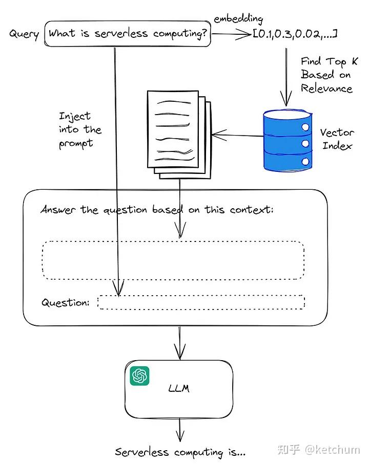
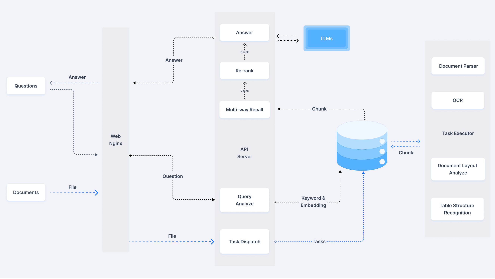

# 第一节 RAG简介

## 一、什么是RAG？

### 1.1 核心定义

RAG（Retrieval-Augmented Generation）是一种**融合信息检索与文本生成**的技术范式。其核心逻辑是：在大型语言模型（LLM）生成文本前，先通过检索机制从外部知识库中动态获取相关信息，并将检索结果融入生成过程，从而提升输出的准确性和时效性[^1][^2][^3]。

> 当然RAG的定义会随着技术的发展而拓展，所以当前定义仅作为基本框架的确立。

💡 **RAG本质**：在LLM生成文本之前，先从**外部知识库**中检索相关信息，作为上下文辅助生成更准确的回答。

### 1.2 技术原理

- **双阶段架构**：  


-在这个过程中，有两个主要步骤：语义搜索和生成输出。在语义搜索步骤中，从知识库中找到与要回答的查询最相关的部分内容。然后，在生成步骤中，将使用这些内容来生成响应。

-我有一个更好的图：

这个图展示了一个检索增强生成（RAG）系统的架构。以下是各个组件及其功能的解释：

### 1. **输入组件**
   - **Questions**: 用户输入的问题。
   - **Documents**: 用户上传的文档文件。

### 2. **Web Nginx**
   - 作为系统的前端服务器，负责处理外部的请求，例如问题和文件的输入。

### 3. **API Server**
   - **Query Analyze**: 对用户的问题进行分析，提取关键词和生成问题的嵌入（Embedding）。
   - **Task Dispatch**: 根据分析的结果，将任务分发给相应的处理模块。
   - **Multi-way Recall**: 通过多种方式从数据库中检索相关信息块（Chunk）。
   - **Re-rank**: 对检索到的信息块进行重新排序，以提高相关性。
   - **Answer**: 结合重新排序后的信息块，生成最终的答案。

### 4. **LLMs（大型语言模型）**
   - 与“Answer”模块交互，用于生成最终的答案。大型语言模型负责理解和生成自然语言的回答。

### 5. **数据库**
   - 存储检索到的信息块（Chunk），这些信息块通过关键词和嵌入进行索引，以便快速检索。

### 6. **任务执行组件（Task Executor）**
   - **Document Parser**: 解析文档内容，提取文本信息。
   - **OCR**: 光学字符识别，用于处理图像中的文本信息。
   - **Document Layout Analyze**: 分析文档的布局结构，提取表格、段落等信息。
   - **Table Structure Recognition**: 识别表格结构，提取表格数据。

### 7. **流程说明**
   1. **问题输入**：
      - 用户通过Web Nginx输入问题。
      - API Server中的**Query Analyze**模块对问题进行分析，提取关键词并生成问题的嵌入向量。
   
   2. **任务分发**：
      - **Task Dispatch**模块根据问题的类型和内容，分发相应的任务（例如文档解析、OCR等）。

   3. **信息检索**：
      - **Multi-way Recall**模块通过关键词和嵌入向量从数据库中检索相关的信息块（Chunk）。
   
   4. **重新排序**：
      - **Re-rank**模块对检索到的信息块进行重新排序，以确保最相关的信息排在前面。
   
   5. **答案生成**：
      - **Answer**模块结合重新排序后的信息块，利用**LLMs**生成最终的答案。
   
   6. **文档处理**：
      - 对于上传的文档，系统会通过**Document Parser**、**OCR**、**Document Layout Analyze**和**Table Structure Recognition**等模块进行处理，提取有用的信息并存储到数据库中。

### 总结
这个RAG系统结合了检索和生成的能力：
- 通过检索模块从大量数据中找到相关信息。
- 利用大型语言模型生成自然语言的答案。
- 同时支持文档解析和图像处理，能够处理多种格式的输入数据。

这种架构适用于需要结合外部知识和生成能力的问答系统，特别是在处理专业文档或非结构化数据时非常有效。

- **关键组件**：
  1. **索引（Indexing）** 📑：将非结构化文档（PDF/Word等）分割为片段，通过嵌入模型转换为向量数据。
  2. **检索（Retrieval）** 🔍️：基于查询语义，从向量数据库召回最相关的文档片段（Context）。
  3. **生成（Generation）** ✨：将检索结果作为上下文输入LLM，生成自然语言响应。

### 1.3 技术演进分类

RAG技术按照复杂度可划分为[^4]：

**初级RAG**
- 基础"索引-检索-生成"流程
- 简单文档分块
- 基本向量检索机制

**高级RAG**
- 增加数据清洗流程
- 元数据优化
- 多轮检索策略
- 提升准确性和效率

**模块化RAG**
- 灵活集成搜索引擎
- 强化学习优化
- 知识图谱增强
- 支持复杂业务场景


## 二、为什么要使用RAG[^5]？

### 2.1 解决LLM的核心局限 

| 问题 | RAG的解决方案 |
|---------------------|----------------------------------|
| **静态知识局限** | 实时检索外部知识库，支持动态更新 |
| **幻觉（Hallucination）** | 基于检索内容生成，错误率降低 |
| **领域专业性不足** | 引入领域特定知识库（如医疗/法律） |
| **数据隐私风险** | 本地化部署知识库，避免敏感数据泄露 |

### 2.2 关键优势 

1. **准确性提升**
- 知识基础扩展：补充LLM预训练知识的不足，增强对专业领域的理解
- 降低幻觉现象：通过提供具体参考材料，减少无中生有的情况
- 可溯源引用：支持引用原始文档，提高输出内容的可信度和说服力

2. **实时性保障**
- 动态知识更新：知识库内容可以独立于模型进行实时更新和维护
- 减少时滞性：规避LLM预训练数据截止日期带来的知识时效性问题

3. **成本效益**
- 避免频繁微调：相比反复微调LLM，维护知识库成本更低
- 降低推理成本：针对特定领域问题，可使用更小的基础模型配合知识库
- 资源消耗优化：减少存储完整知识在模型权重中的计算资源需求
- 快速适应变化：新信息或政策更新只需更新知识库，无需重训练模型

4. **可扩展性**
- 多源集成：支持从不同来源和格式的数据中构建统一知识库
- 模块化设计：检索组件可独立优化，不影响生成组件

### 2.3 适用场景风险分级 

> 以下是RAG技术在不同风险等级场景中的适用性

| 风险等级 | 案例 | RAG适用性 |
|:--------:|:------------------------------|:--------------------------:|
| **低风险** | 翻译/语法检查 | 高可靠性 |
| **中风险** | 合同起草/法律咨询 | 需结合人工审核 |
| **高风险** | 证据分析/签证决策 | 需严格质量控制机制 |

## 三、如何上手RAG？

### 3.1 基础工具链选择

**开发框架**
- **LangChain**：提供预置RAG链（如rag_chain），支持快速集成LLM与向量库
- **LlamaIndex**：专为知识库索引优化，简化文档分块与嵌入流程

**向量数据库**
- **Milvus**：开源高性能向量数据库
- **FAISS**：轻量级向量搜索库
- **Pinecone**：云服务向量数据库

### 3.2 四步构建最小可行系统（MVP）

1. **数据准备**
   - 格式支持：PDF、Word、网页文本等
   - 分块策略：按语义（如段落）或固定长度切分，避免信息碎片化

2. **索引构建**
   - 嵌入模型：选取开源模型（如text-embedding-ada-002）或微调领域专用模型
   - 向量化：将文本分块转换为向量存入数据库

3. **检索优化**
   - 混合检索：结合关键词（BM25）与语义搜索（向量相似度）提升召回率
   - 重排序（Rerank）：用小模型筛选Top-K相关片段（如Cohere Reranker）

4. **生成集成**
   - 提示工程：设计模板引导LLM融合检索内容
   - LLM选型：GPT、Claude、Ollama等（按成本/性能权衡）

### 3.3 新手友好方案

- **LangChain4j Easy RAG**：仅需上传文档，自动处理索引与检索
- **FastGPT**：开源知识库平台，可视化配置RAG流程
- **GitHub模板**：如"TinyRAG"项目[^6]，提供完整代码

### 3.4 进阶调优方向

**评估指标**
```
检索质量：上下文相关性（Context Relevance）
生成质量：答案忠实度（Faithfulness）、事实准确性
```

**性能优化**
```
索引分层：对高频数据启用缓存机制
多模态扩展：支持图像/表格检索
```

> RAG技术仍在快速发展中，可以持续关注学术和工业界的最新进展！

## 参考文献

[^1]: [Genesis, J. (2025). *Retrieval-Augmented Text Generation: Methods, Challenges, and Applications*](https://www.researchgate.net/publication/391141346_Retrieval-Augmented_Generation_Methods_Applications_and_Challenges).

[^2]: [Gao et al. (2023). *Retrieval-Augmented Generation for Large Language Models: A Survey*](https://arxiv.org/abs/2312.10997).

[^3]: [Lewis et al. (2020). *Retrieval-Augmented Generation for Knowledge-Intensive NLP Tasks*](https://arxiv.org/abs/2005.11401). 

[^4]: [Gao et al. (2024). *Modular RAG: Transforming RAG Systems into LEGO-like Reconfigurable Frameworks*](https://arxiv.org/abs/2407.21059).

[^5]: [*RAG: Why Does It Matter, What Is It, and Does It Guarantee Accuracy?*](https://www.lawdroidmanifesto.com/p/rag-why-does-it-matter-what-is-it).

[^6]: [*TinyRAG: GitHub项目*](https://github.com/KMnO4-zx/TinyRAG). 
